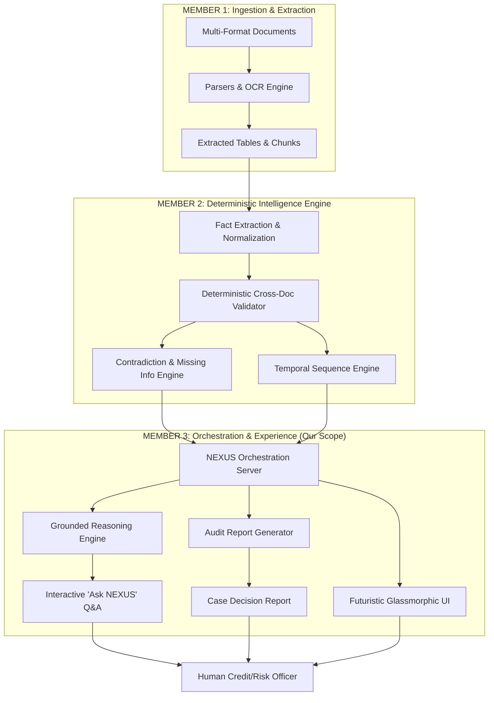

# NEXUS AI — MEMBER 3 ARCHITECTURAL SPECIFICATION

**Author:** Member 3 (Reasoning + Orchestration + User Experience)  
**System:** NEXUS AI — Evidence-Centric Information Intelligence  
**Branch:** `feature/member3-experience`  
**Date:** October 8, 2026  

---

## 1. Subsystem Responsibility & Boundaries

Member 3 owns the **Orchestration, Reasoning, and User Experience Layer** of NEXUS AI. It transforms deterministic facts, entity graphs, detected contradictions, and page-level evidence produced by Member 2 into human-understandable, audit-ready decision intelligence.

---

## 2. Core Architectural Principles Enforced

1. **"The unit of intelligence is the FACT, not the document."**  
   Every atomic assertion in Member 3 conforms to the standard tuple:
   $$\text{Fact} = \langle \text{Entity}, \text{Attribute}, \text{Value}, \text{Time}, \text{Context}, \text{Source}, \text{Confidence} \rangle$$
2. **"AI interprets information. Deterministic systems validate information."**  
   The LLM reasoning engine is strictly prevented from acting as a calculator, validator, or primary database. All numerical delta calculations, threshold breaches, and contradiction alerts are deterministically computed by rule engines.
3. **Traceability to Primary Source:**  
   Every claim displayed in the UI links directly back through:
   $$\text{Finding} \longrightarrow \text{Fact} \longrightarrow \text{Document} \longrightarrow \text{Page Number} \longrightarrow \text{Exact Highlighted Snippet}$$
4. **Human-in-the-Loop Decision Support:**  
   The system never autonomously approves or rejects high-risk loan or grant applications. Verdicts are classified as `REVIEW_REQUIRED`, outputting actionable guidance for human underwriters.

---

## 3. Orchestration Subsystem (`orchestrator/`)

- **Runtime:** Node.js (Express ESM architecture)
- **Port:** `5001` (proxied seamlessly via Vite on port `3000`)
- **Key Modules:**
  - `server.js`: RESTful router providing metrics, document ingestion tracking, findings, timeline, and graph APIs.
  - `services/reasoning-engine.js`: Zero-hallucination grounded reasoning engine. Matches user intent and retrieves exact facts and contradictory sources.
  - `services/report-generator.js`: Decision intelligence report generator synthesizing executive summaries, deterministic risk indices, and actionable guidance.
  - `services/member2-client.js`: Resilient adapter with live polling to Member 2's backend (`MEMBER2_URL`, default `http://localhost:8000`), with instant fallback to calibrated case data.

---

## 4. Frontend Experience Subsystem (`frontend/`)

- **Tech Stack:** React 19 + TypeScript + Vite + Tailwind CSS v4 + Lucide Icons
- **Design Tokens:**
  - Dark backdrop: `#080a0f` / `#090b10`
  - Accent Color: Neon Lime (`#ccff00` / `rgba(204, 255, 0, 0.25)`)
  - Secondary Accents: Emerald (`#10b981`), Cyan (`#06b6d4`), Crimson (`#f43f5e`), Amber (`#f59e0b`)
  - Glassmorphic panels with backdrop blur (`backdrop-blur-xl`) and subtle glowing borders.

---

## 5. Non-Interference & Git Merge Safety

Member 3 works in complete isolation on branch `feature/member3-experience`:
- All client-side code lives in `frontend/`
- All orchestration logic lives in `orchestrator/`
- All interface definitions live in `shared/contracts/`
- Member 1 files (`ingestion/`, `ocr/`) and Member 2 files (`facts/`, `engine/`) are completely untouched, guaranteeing zero merge conflicts.
